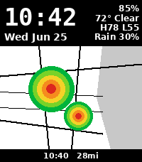

# WSR-88D Radar — Pebble Time 2 watchface

A watchface for the **Pebble Time 2** (`emery`, 200×228 color) that shows the
**time, date, and watch battery** over a live **weather-surveillance radar**
loop, painted on a **light or dark map** of your location. Range, map style,
radar color scheme, update frequency, and an on-tap
animation of the last scans are all configurable through a **Clay** settings
page.



*(mockup — header shows the large clock, date, battery, and current weather /
high-low / rain chance; the map is a B/W road outline with the latest NEXRAD
radar overlaid; the bottom strip shows the scan time and current range.)*

Tap the watch to animate the last *N* radar scans.

## How it works

PebbleKit JS on the phone has no canvas or image decoder of its own and the
watch's PNG decoder only handles palettized PNGs, so all image work is done in
JS with a bundled pure-JS PNG decoder, and the watch is a thin compositor:

1. The watch sends a refresh request (on launch, on the configured interval,
   on a tap with no data, or after a settings change), including its exact
   map-area pixel size.
2. The phone resolves your location (GPS or manual), reads the
   [RainViewer](https://www.rainviewer.com/api/weather-maps-api.html) frame
   index (free, no API key), and figures out which slippy `z/x/y` tiles cover
   the view. Map tiles and radar tiles share the **same** tile grid, so the
   layers line up pixel-for-pixel.
3. For the default map the phone queries **OpenStreetMap** (Overpass API, no
   key) for major roads + coastline + water in view and draws them as **bold
   vector lines** — a clean, glanceable, high-contrast map with no labels or
   clutter, rendered in the same projection as the radar so they align. (Other
   styles fetch raster tiles — CARTO Voyager, or Stamen Toner with a free
   Stadia key — decoded via UPNG/pako and quantized to Pebble's 64 colors.)
   The radar tiles are quantized and overlaid on top.
4. Each layer is **run-length encoded** (mostly transparent → tiny) and
   streamed to the watch in acked AppMessage chunks.
5. The watch paints the base map once, overlays the current radar frame, and
   cycles frames on tap.

This keeps transfers to a few KB per refresh and needs **no server** of your
own and **no API keys**.

### Source layout

```
package.json          Pebble manifest (emery + basalt/chalk/diorite), Clay dep, message keys
wscript               waf build script
src/c/
  main.c              window, clock/date/battery, services, refresh scheduling, tap
  scene.c/.h          RLE compositor (framebuffer) + tap animation
  comm.c/.h           AppMessage: chunked image reassembly, settings, requests
  settings.c/.h       persisted settings + range/units labels
  wsr88d.h            shared protocol + RLE format docs
src/pkjs/
  index.js            orchestration: location -> radar index -> fetch -> encode -> send
  tiles.js            slippy-tile math, PNG fetch/decode, viewport compositing
  render.js           map edge-detection, radar color quantization, RLE encoder
  transport.js        chunked AppMessage send with flow control + retry
  config.js           Clay configuration schema
  vendor/             UPNG.js + pako (inflate) — bundled, required by path
.github/workflows/build.yml   CI: builds the .pbw and uploads it as an artifact
```

## Configuration (Clay)

Open the watchface settings from the Pebble mobile app:

| Setting | Options | Notes |
|---|---|---|
| Location source | Automatic (GPS) / Manual | defaults to GPS; manual takes a latitude & longitude |
| Radar color scheme | 9 RainViewer schemes | Original, Universal Blue, NEXRAD III, … |
| Smooth radar | on/off | RainViewer smoothing |
| Distinct snow colors | on/off | |
| Loop frames | 1–10 | scans animated on tap |
| Animate loop on tap | on/off | |
| Map detail | Minimal / Standard / Detailed | edge-detection threshold (major roads → more features) |
| Zoom / range | level 4–10 | radar tiles cap at z7; z8–10 upscale the radar to follow the map |
| Map style | Roads&coastline (clean) / dark / Stamen Toner / Full color / Custom | default draws bold major roads + coastline from OpenStreetMap vector data (no key); Toner needs a free Stadia key |
| Map tile URL | template | advanced; any `{z}/{x}/{y}` raster source |
| Units | Miles / Kilometers | also selects °F vs °C for the weather readout |
| Update frequency | 5 / 10 / 15 / 30 / 60 min | watch-driven refresh interval |

The header also shows **current temperature + condition, today's high/low, and
chance of rain** (from [Open-Meteo](https://open-meteo.com/), free, no key).

## Building

### Locally

Requires the [Pebble SDK](https://developer.repebble.com/sdk/) (`pebble-tool`,
Python 3.13):

```bash
pip install pebble-tool
pebble sdk install latest
pebble build                       # produces build/wsr88d-radar.pbw
pebble install --emulator emery    # try it in the emulator
```

To run on a watch, enable **Dev Connect** in the Pebble app (Devices → ⋯ → Dev
Connect, sign in with GitHub) and `pebble install --phone <ip>`.

### CI

Every push builds the `.pbw` via GitHub Actions
(`.github/workflows/build.yml`) and uploads it as the **`wsr88d-radar`**
artifact. Download it from the run's Artifacts section and side-load it.

## Notes & limits

- **Range** is capped by RainViewer's max zoom (7), so "Local" is roughly a
  55-mile radius — radar coverage, not street level.
- The map outline is generated by edge-detection, giving a clean line-art look
  on any tile style; "major roads" appear at low detail, more streets/features
  at higher detail.
- Default tiles ([CARTO](https://carto.com/basemaps) light, RainViewer) are
  free for personal use — please respect their usage policies. Swap the map URL
  in settings for any other `{z}/{x}/{y}` source (e.g. a keyed Stadia/Stamen
  Toner endpoint) if you prefer.
- Targets `emery` primarily; also builds for `basalt`, `chalk`, and `diorite`
  (radar color degrades to black-and-white on 1-bit `diorite`).

## Attribution

- Radar: RainViewer (NOAA / NWS NEXRAD WSR-88D network).
- Map: © OpenStreetMap contributors, © CARTO (default basemap).
- Weather: Open-Meteo (CC-BY 4.0).
- PNG decoding: UPNG.js (MIT), pako (MIT).

## License

MIT
